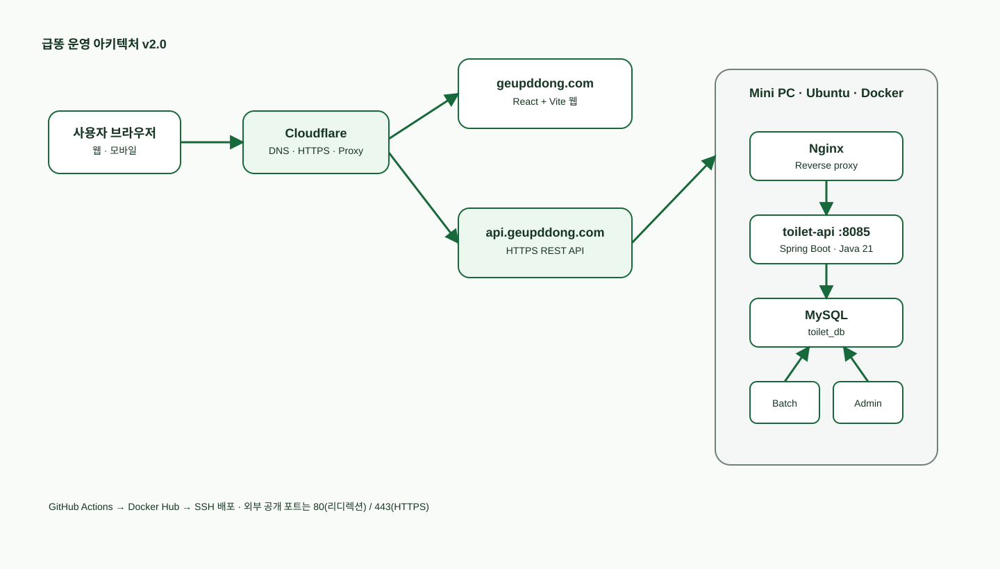

# 📚 급똥 프로젝트 문서

급똥 서비스의 요구사항, API·DB 명세, 아키텍처, 운영 가이드를 관리하는 문서 저장소입니다. 문서는 도메인별 폴더로 관리하며, 새 문서는 아래 분류에 맞춰 추가합니다.

| 운영 서비스 | Public API | 프로젝트 관리 |
| --- | --- | --- |
| [geupddong.com](https://geupddong.com) | [api.geupddong.com](https://api.geupddong.com) | [WBS](https://github.com/orgs/toilet-project/projects/2/views/2) |

## 문서 목록

| 구분 | 문서 | 설명 |
| --- | --- | --- |
| 아키텍처 | [아키텍처 v2.1](architecture/architecture-v2.md) | 현재 운영 구조, 데이터 흐름, 배포 구성 |
| 운영 | [배포·운영 가이드](operations/deployment.md) | 도메인, HTTPS, 배포 및 비밀정보 원칙 |
| API | [Toilet API 명세](api/toilet-api.md) | 지도 영역 조회와 화장실 상세 조회 |
| DB | [Toilet 테이블 명세](database/toilet-table.md) | 화장실 데이터베이스 구조와 마이그레이션 DDL |
| DB | [사용자 제보·좌표·개방시간 승인 모델 v1.3](database/user-report-coordinate-model.md) | 위치·개방시간 제보 상태 전이, 확정 좌표·주소 이력 및 DDL 초안 |
| 변경 이력 | [문서 변경 이력](changelog/CHANGELOG.md) | 스키마·아키텍처 등 주요 문서 변경 기록 |
| 기획 | [요구사항 정의서](planning/requirements.md) | 서비스 목표와 향후 확장 범위 |
| 기획 | [인증·권한 정책 및 데이터 모델 설계 v1.1](planning/authentication-authorization-design.md) | Google·Kakao 로그인, USER/ADMIN 권한, JWT·Redis 세션·감사 로그 설계 |

## 최신 아키텍처

## 문서 추가 규칙

- 아키텍처 자료와 원본 다이어그램은 `architecture/`에 둡니다.
- 스키마·DDL·데이터 정책은 `database/`에 둡니다.
- 외부·내부 API 계약은 `api/`에 둡니다.
- 배포·보안·장애 대응은 `operations/`에 둡니다.
- 요구사항·의사결정 기록은 `planning/`에 둡니다.
- 서비스 동작에 영향을 주는 확정 변경은 `changelog/CHANGELOG.md`에 최신순으로 추가합니다.
