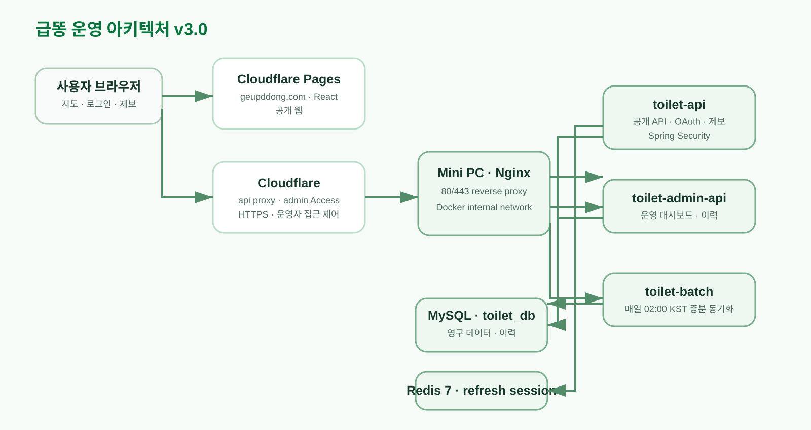

# 📚 급똥 프로젝트 문서

급똥 서비스의 요구사항, API·DB 명세, 아키텍처, 운영 가이드를 관리하는 문서 저장소입니다. 문서는 도메인별 폴더로 관리하며, 새 문서는 아래 분류에 맞춰 추가합니다.

| 운영 서비스 | Public API | 프로젝트 관리 |
| --- | --- | --- |
| [geupddong.com](https://geupddong.com) | [api.geupddong.com](https://api.geupddong.com) | [WBS](https://github.com/orgs/toilet-project/projects/2/views/2) |

## 최신 작업 요약

행정구역 정규화는 설계 → 표본 검증 → 전수 분석 → 운영 적재 → 관리자 검토 → 실제 제보 승인·자동 재판정까지 확인했습니다. 다음 정기 배치의 확정 좌표·주소 보호 확인은 남아 있습니다. [관리자 검토 배포 보고서](operations/region-admin-review-release-2026-09-05.md)에서 최신 결과를 확인할 수 있습니다. 과거 보고서는 당시 시점의 기록이며, 상세 JSON·시설별 검토 목록은 비공개로 보존합니다.

## 문서 목록

| 구분 | 문서 | 설명 |
| --- | --- | --- |
| 아키텍처 | [아키텍처 v3.0](architecture/architecture-v3.md) | Cloudflare·Mini PC·인증·배치까지 반영한 현재 운영 구조 |
| DB · 구현안 | [회원 탈퇴·복구·파기 v1.11](database/account-withdrawal-retention-v1.11.md) | 선택 동의·3개월 복구·회원 연결 파기. 운영 미적용 |
| 운영 · 적용 전 필수 | [회원정보 자동 파기 Runbook](operations/account-erasure-runbook.md) | MySQL·백업 복원 검증, 모니터링, 재시도·롤백 제한 |
| 운영 · 구현 검증 | [탈퇴·복구 검증 결과](operations/account-retention-verification-2026-09-06.md) | 로컬 SQL·인증·모바일/PC 검증, 전체 테스트 실패·미검증 사항 |
| 운영 | [배포·운영 가이드](operations/deployment.md) | 도메인, HTTPS, 배포 및 비밀정보 원칙 |
| 운영 | [운영 안정화 Runbook v1.1](operations/reliability-runbook.md) | 암호화 백업·복구, 재부팅 자동 점검, DB·OAuth 장애 알림 절차 |
| 운영 | [DB 백업·복구 리허설](operations/backup-restore-rehearsal-2026-08-31.md) | 실제 운영 백업과 임시 복구 검증 결과 |
| API | [Toilet API 명세](api/toilet-api.md) | 공개 지도·인증·제보·관리자 API 계약 |
| DB | [기본 데이터 모델 v1.7](database/database-schema-v1.7.md) | 정책 버전·사용자 동의·탈퇴 모델. 이후 변경은 v1.8~v1.10 참조 |
| DB | [행정구역 정규화 v1.8](database/administrative-region-normalization-v1.8.md) | 좌표 기반 행정구역·주소 교차검증·안전한 분할 실행 |
| DB | [좌표 확정 주소 분리 v1.9](database/coordinate-address-fields-v1.9.md) | 위치 제보·관리자 확정의 도로명/지번 저장, DDL·복구 절차 |
| DB | [자동 재검증·수동 확인 이력 v1.10](database/region-assessment-history-v1.10.md) | 추가 주소 검증·50m 기준·판정 근거 보존·판정 근거·관리자 검토 연결 |
| 운영 · 최신 | [관리자 검토 배포 보고서](operations/region-admin-review-release-2026-09-05.md) | 검토 API·지도 보정·권한·테스트·남은 E2E |
| 운영 · 적재 | [행정구역 운영 반영 결과](operations/region-production-result-2026-09-05.md) | API·배치 배포, 백업 복원, 실제 적재, 자동 갱신 검증 |
| 운영 · 회귀 검증 | [자동 재검증 v2 결과](operations/region-recheck-v2-review-2026-09-04.md) | 기록 응답 1,000건 재현: 991 자동·9 수동, 당시 테스트 기록 |
| 운영 · 전체 검증 완료 | [전수 분석 최종 보고서](operations/region-full-final-review-2026-09-05.md) | 최신 52,294건 분석·51,985건 통과·309건 검토·좌표 누락 1,288건 |
| 운영 · 검토 목록 | [수동 검토 309건](operations/region-full-manual-review-2026-09-05.md) | 사유별 집계·처리 원칙, 상세 원문 비공개 |
| 운영 · 실행 절차 | [DB 반영 코드·DDL 실행안](operations/region-production-apply-plan-2026-09-05.md) | 외부 호출 없는 replay·백업·migration·재개·롤백 |
| 운영 · DB 검증 | [V8~V10 실제 MySQL 검증](operations/region-mysql-v10-validation-2026-09-04.md) | 격리 MySQL 순차 DDL·원본 보존·인덱스·복구 검증, 전체 분석 준비 |
| 운영 · 검증 | [주소 분리 저장 검증](operations/coordinate-address-fields-review-2026-09-04.md) | API/배치 자동 테스트·화면 호환·운영 적용 전 확인 사항 |
| 운영 · 초기 검증 | [행정구역 정규화 검증 결과](operations/region-normalization-review-2026-09-04.md) | DB 현황·자동 테스트·운영 표본 분석·남은 승인 사항 |
| 운영 · 표본 검증 | [실제 Kakao API 84건 분석](operations/region-normalization-sample-2026-09-04.md) | 67건 지역 일치·17건 검토 대상, 재개 및 원본 보존 확인 |
| 운영 · 무작위 검증 | [1,000건 자동·수동 처리 판단](operations/region-normalization-random1000-2026-09-04.md) | 963건 일치·28건 자동 재검증 후보·9건 수동 우선 확인, 원본 변경 없음 |
| DB | [Toilet 테이블 명세](database/toilet-table.md) | 공공데이터·좌표 정책을 포함한 화장실 원천 데이터 |
| DB | [사용자 제보·좌표·개방시간 승인 모델 v1.4](database/user-report-coordinate-model.md) | 제보 상태 전이, 확정 좌표·주소 이력 및 적용 DDL |
| DB | [중복 좌표 데이터 품질 관리](database/duplicate-coordinate-quality.md) | 동일 좌표 그룹 확인, 직접 보정, 이력·배치 보호 정책 |
| 변경 이력 | [문서 변경 이력](changelog/CHANGELOG.md) | 스키마·아키텍처 등 주요 문서 변경 기록 |
| 기획 | [요구사항 정의서](planning/requirements.md) | 서비스 목표와 향후 확장 범위 |
| 기획 | [인증·권한 정책 및 데이터 모델 설계 v1.5](planning/authentication-authorization-design.md) | Google·Kakao 로그인, 정책 동의, USER/ADMIN 권한, JWT·Redis 세션·감사 로그 구현 기준 |
| 기획 | [개인정보·서비스 약관 및 회원 동의 정책 v1.0](planning/privacy-policy-consent-v1.md) | 만 14세 이상, 정책 버전 동의, GPS 고지, 보유·파기·탈퇴 기준 |

## 최신 아키텍처

## 문서 추가 규칙

- 아키텍처 자료와 원본 다이어그램은 `architecture/`에 둡니다.
- 스키마·DDL·데이터 정책은 `database/`에 둡니다.
- 외부·내부 API 계약은 `api/`에 둡니다.
- 배포·보안·장애 대응은 `operations/`에 둡니다.
- 요구사항·의사결정 기록은 `planning/`에 둡니다.
- 서비스 동작에 영향을 주는 확정 변경은 `changelog/CHANGELOG.md`에 최신순으로 추가합니다.
