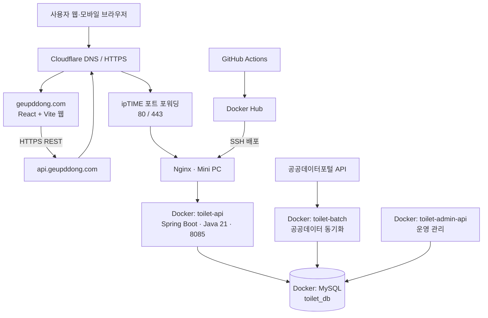

# 아키텍처 v2.1

> 2026-08 기준 운영 구조입니다. 외부에 공개되는 웹과 API는 HTTPS만 사용하며, 서버 간 컨테이너 통신과 DB는 Mini PC 내부 네트워크에 둡니다.

## 컴포넌트 책임

| 컴포넌트 | 책임 |
| --- | --- |
| `toilet-web` | 카카오맵 지도, 현재 위치, 장소 검색, 마커/클러스터, 상세 카드 UI |
| `toilet-api` | Bounding Box 기반 마커·클러스터 조회, 화장실 상세 REST API |
| `toilet-batch` | 최근 3일 공공데이터 수집·변환·DB upsert, 카카오 주소 지오코딩 및 좌표 메타데이터 관리 |
| `toilet-admin-api` | 운영 데이터 관리 기능 |
| MySQL | 공중화장실 원천·가공 데이터 보관 |
| Nginx | 외부 HTTP→HTTPS 리디렉션과 API 리버스 프록시 |
| Cloudflare | 도메인 DNS, TLS, 외부 프록시 계층 |

## 외부 공개 원칙

- 웹: `https://geupddong.com`
- API: `https://api.geupddong.com/api/v1/...`
- Mini PC의 Spring Boot·MySQL 포트는 외부에 직접 공개하지 않습니다.
- HTTP 80 포트는 인증 및 HTTPS 리디렉션 용도로만 사용하고, 서비스 요청은 443으로 처리합니다.

## 배치 좌표 보정 흐름

1. 매일 02:00(Asia/Seoul)에 최근 3일 갱신 공공데이터를 수신합니다.
2. 신규·주소 변경·좌표 미보유·과거 실패 건만 도로명 주소로 지오코딩하고, 실패하면 지번 주소로 한 번 더 시도합니다.
3. 결과와 주소 해시·처리 시각·좌표 출처를 함께 저장합니다.
4. 관리자 확정 좌표(`ADMIN_CONFIRMED`)는 자동 동기화가 변경하지 않습니다.

## 변경 이력

| 버전 | 일자 | 변경 내용 |
| --- | --- | --- |
| v2.1 | 2026-08-26 | 증분 공공데이터 동기화·카카오 지오코딩·좌표 메타데이터 관리 흐름 반영 |
| v2.0 | 2026-08 | 도메인·HTTPS·Mini PC 컨테이너 운영 구조 반영 |
