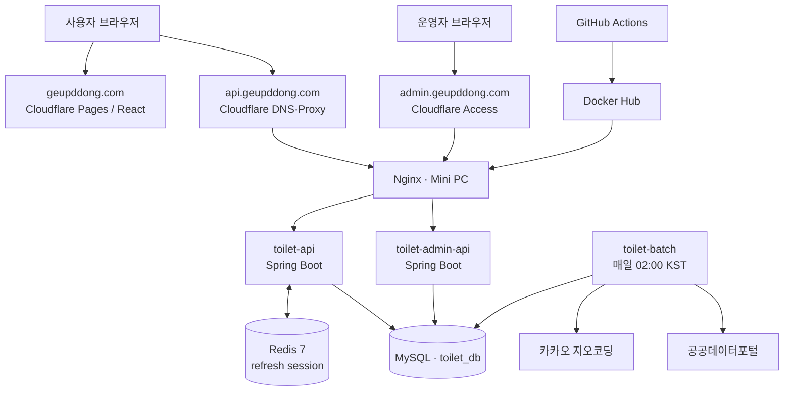

# 급똥 운영 아키텍처 v3.0

> 기준일: 2026-08-31 · 상태: 운영 반영 기준

## 1. 구성과 외부 경계

| 영역 | 구성 | 책임 |
| --- | --- | --- |
| 사용자 웹 | Cloudflare Pages, `toilet-web` | 지도 탐색, 로그인, 제보 작성 |
| 공개 API | Cloudflare → Nginx → `toilet-api` | 지도·상세 조회, OAuth, 제보, 관리자 인가 API |
| 관리자 웹 | `admin.geupddong.com`, Cloudflare Access | 운영 대시보드·배치 이력·제보 검토 진입 경계 |
| 운영 API | Nginx → `toilet-admin-api` | 관리자 화면용 배치/집계 조회 |
| 데이터 | MySQL, Redis | 영구 데이터 / 만료형 refresh 세션 |
| 배치 | `toilet-batch` | 공공데이터 증분 수집·지오코딩·동기화 이력 기록 |

## 2. 보안 경계

| 대상 | 외부 노출 | 보호 방식 |
| --- | --- | --- |
| 웹 | 공개 HTTPS | Cloudflare Pages, 도메인 HTTPS |
| 공개 API | 공개 HTTPS | Cloudflare 프록시, Nginx, Spring Security, CORS |
| 관리자 | 승인 운영자만 | Cloudflare Access + 애플리케이션 `ADMIN` 역할 |
| MySQL·Redis·배치 | 비공개 | Docker 내부 네트워크, 외부 포트 미노출 |
| 배포 | GitHub Actions만 | Docker Hub 이미지 수신 후 SSH 배포 |

비밀값은 GitHub Repository Secrets와 Mini PC의 런타임 환경 변수에서만 관리한다. 문서·소스·이미지에는 키 값, 내부 IP, 계정 비밀번호를 기록하지 않는다.

## 3. 핵심 흐름

### 로그인과 세션

1. 웹이 API의 Google 또는 Kakao OAuth 시작 주소로 이동한다.
2. API는 제공자 콜백에서 `app_user`, `user_social_account`, `user_role`을 조회/생성한다.
3. API는 15분 access JWT와 14일 refresh 난수를 발급한다. access JWT는 `geupddong_access`, refresh는 `geupddong_refresh` HttpOnly·Secure 쿠키로 전달한다.
4. Redis에는 refresh token 원문이 아닌 SHA-256 해시와 TTL만 저장한다. 로그아웃·재발급은 해당 키를 폐기하거나 회전한다.

### 사용자 제보와 승인

1. 로그인 사용자가 화장실 상세에서 위치 또는 개방시간 제보를 제출한다.
2. API는 `toilet_report`를 `PENDING`으로 저장한다.
3. 관리자는 별도 검토 화면에서 기존 위치·제보 위치를 비교하고 필요 시 승인 좌표를 보정한다.
4. 승인 트랜잭션은 `toilet`, `coordinate_revision`, `audit_log`를 함께 갱신한다. 확정 좌표는 `ADMIN_CONFIRMED`로 표기되어 자동 배치가 덮어쓰지 않는다.

### 공공데이터 동기화

매일 02:00(Asia/Seoul)에 최근 3일 갱신분을 수집한다. 신규·주소 변경·좌표 누락·지오코딩 실패 항목만 지오코딩하고, 결과와 실패 수를 `batch_sync_history`에 기록한다. 관리자 확정 좌표는 보존한다.

## 4. 버전 이력

| 버전 | 일자 | 변경 |
| --- | --- | --- |
| v3.0 | 2026-08-31 | OAuth·Redis·사용자 제보·관리자·배치 이력·Cloudflare Access를 현재 운영 구조에 반영 |
| v2.1 | 2026-08-26 | 증분 지오코딩·관리자 확정 좌표 정책 반영 |
