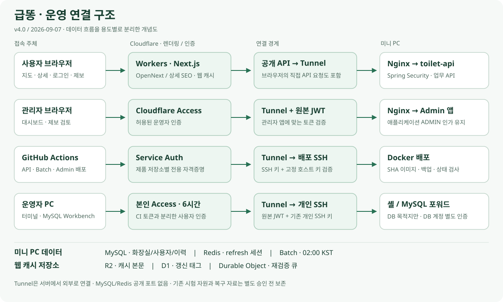

# 급똥 운영 아키텍처 v4.0

> 2026-09-07 기준. 운영 연결·실제 배포·공유기 교체 결과를 반영한 구조이며, 아래 미완료 검증은 별도로 남긴다.

## 1. 사용자 웹과 캐시

사용자 웹은 React SPA/Pages 중심 구조에서 **Next.js·OpenNext를 실행하는 Cloudflare Workers**로 전환했다. 메인 도메인의 공개 경로와 준비용 빌드 설정을 분리하며, 기존 Pages 자료는 복구용으로 보존한다. Pages 프로젝트가 존재한다는 이유로 현재 사용자 웹을 Pages 서비스라고 표시하지 않는다.

| 구성 | 책임 / 주의 |
| --- | --- |
| Workers · Next.js/OpenNext | 지도·상세 화면, 상세 URL 및 SEO 응답 |
| R2 incremental cache | 웹 캐시 저장소; MySQL 업무 원본과 별개 |
| D1 tag cache | 웹 캐시 태그 갱신 정보; 사용자·화장실 원본 DB 아님 |
| Durable Object queue | 캐시 재검증 작업 조정 |
| Spring API 변경 전송 | DB에 커밋된 변경 ID를 전용 서명 요청으로 웹에 전달; 실패 시 재시도 |

서버 캐시 갱신은 이미 열린 브라우저의 모든 카드/메모리 상태를 즉시 교체하는 기능과 다르다. 캐시·전송 장애 시 최신성은 별도 확인한다. Next.js로 전환해도 지도 SDK는 기존 Kakao Maps를 사용한다.

## 2. 외부 접속 경계

| 용도 | 경로 | 인증 |
| --- | --- | --- |
| 공개 API | Cloudflare → Tunnel → 로컬 Nginx → toilet-api | 공개 조회/인증 필요 API를 Spring Security가 구분 |
| 관리자 | Cloudflare Access → Tunnel → 로컬 Nginx → toilet-admin-api | Access 및 원본 JWT 검증, 앱 ADMIN 인가 |
| 제품 배포 | GitHub Actions → Service Auth → Tunnel → 배포 SSH | 저장소별 토큰 + SSH 키 + 고정 호스트 키 |
| 개인 관리 | 본인 Access → Tunnel → 개인 SSH | 본인 이메일 + 원본 JWT + 기존 개인 SSH 키 |
| Workbench | PC 로컬 포워드 → 개인 SSH → MySQL loopback | 위 SSH 인증 후 기존 DB 계정으로 별도 인증 |

Tunnel은 미니 PC가 외부로 연결한다. 현재 API·관리·배포 접속은 기존 DDNS 주소나 공유기의 서비스 포트포워딩을 필수 경로로 삼지 않는다. Tunnel이 끊기면 공개 연결에 영향이 있으므로 백엔드 정상과 Tunnel 정상은 별도 점검한다.

개인 SSH와 배포 SSH는 별도 loopback 서비스다. 개인 서비스의 포워딩은 MySQL 목적지만 허용하고 원격·에이전트 포워딩은 금지한다. 관리자 셸의 기존 운영 권한을 격리하는 샌드박스는 아니다. CI용 서비스 토큰을 개인 Workbench에 공유하지 않는다.

## 3. 미니 PC 내부 서비스와 데이터

| 서비스 | 책임 |
| --- | --- |
| toilet-api | 화장실 조회·OAuth·제보·권한·확정 좌표/주소 변경·캐시 변경 전송 |
| toilet-admin-api | 관리자 화면·운영 조회·제보 검토·배치 이력 |
| toilet-batch | 공공데이터 증분 동기화 및 행정구역 판정 작업 |
| MySQL | 화장실·사용자·제보·감사/배치/정규화 이력 등 영구 데이터 |
| Redis | 인증 refresh 세션; 재시작 시 재로그인하는 비영속 정책 |

MySQL은 서버 loopback/내부 네트워크로 접근하며 인터넷 공개 DB 포트를 만들지 않는다. Redis도 공개 포트를 만들지 않는다. 관리자 확정 좌표·도로명/지번 주소는 원본·변경 이력과 구분해 저장하고, 좌표 변경 뒤 행정구역 판정이 다시 이루어진다. 제보와 데이터 모델의 상세 계약은 해당 API/DB 문서를 기준으로 한다.

공공데이터 배치는 02:00 KST 일정이다. 계정 보관·자동 파기·외부 파기 대장/checkpoint 설계는 별도 WBS에서 관리하며, **준비 배포된 기능을 자동 파기 활성화 완료로 표시하지 않는다.** 웹 캐시용 R2와 파기 검증 대장용 R2의 목적·자격증명은 분리한다.

## 4. 공유기·운영 검증

- 고정 IP/gateway 의존을 DHCP로 전환하고 실제 공유기 교체 후 Tunnel 연결 4개와 내부 SSH·공개 API·관리자 화면을 확인했다.
- 기존 호스트 키로 동일 서버를 확인했다. 내부 IP·MAC·사용자별 실행 명령은 비공개 인수 문서에 보관한다.
- 단계별 원복 타이머는 확인 후 비활성화했다. 상시 자동 복구 장치가 아니다.
- API/Batch/Admin의 실제 Tunnel 경유 배포와 이전 이미지/설정 보존을 확인했다. 전체 호스트 재부팅·실제 구버전 rollback은 별도 미완료다.
- 내부·외부 SSH 포워드에서 MySQL 응답을 확인했고 서버 측 운영 DB 계정으로 읽기 전용 인증도 확인했다. Workbench GUI의 최종 Test Connection 확인은 별도다.

## 5. 남은 검증

TLS 실제 staging 갱신, Tunnel 감시 보완의 운영 설치/알림 인수, 공급자별 인증·세션 세부 검증, 다음 정기 배치 및 테스트 자원 정리를 남긴다. 테스트라는 이름이 붙은 공유 Tunnel도 운영 트래픽을 운반하므로 이름만 보고 삭제하지 않는다.

[접속·Workbench 인수](../operations/tunnel-access-runbook.md) · [총괄 WBS #73](https://github.com/toilet-project/docs/issues/73) · [운영 배포 #77](https://github.com/toilet-project/docs/issues/77) · [복구·감시 #78](https://github.com/toilet-project/docs/issues/78).

## 버전 이력

| 버전 | 기준일 | 범위 |
| --- | --- | --- |
| v4.0 | 2026-09-07 | Workers/Next.js·캐시, 운영 Tunnel·관리/배포 SSH·공유기 교체 |
| [v3.0](architecture-v3.md) | 2026-08-31 | 당시 Pages/React·OAuth·Redis·제보·배치 구조 |
