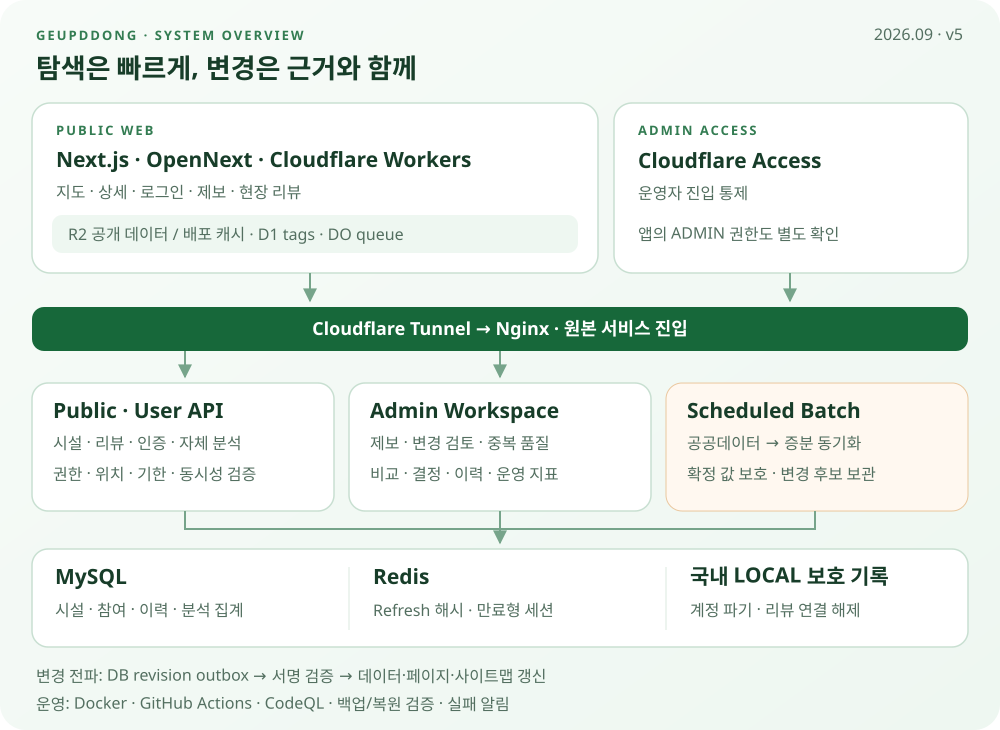

# 급똥 운영 아키텍처 v5

2026-09-17 · Next.js·Workers, 데이터 품질 관리, 현장 리뷰, 자체 분석, 캐시 수명주기를 반영한 현재 구조입니다.

## 요청과 데이터의 경계

| 경계 | 역할 |
| --- | --- |
| 사용자 웹 | Next.js/React·TypeScript, OpenNext를 통해 Cloudflare Workers에서 제공 |
| 웹 캐시 | R2 공유 공개 데이터와 배포별 HTML/RSC 분리. D1 tag cache·Durable Object queue |
| 공개 API | Cloudflare 프록시 → Tunnel → Nginx → Spring Boot API |
| 관리자 | Cloudflare Access → Tunnel → Nginx → 관리자 서비스, 애플리케이션 ADMIN 검증 |
| 영구 데이터 | MySQL의 시설·리뷰·제보·동의·변경 이력·분석 집계 |
| 만료형 세션 | Redis의 refresh 해시·TTL. 영구 업무 원장과 구분 |
| 보호 기록 | 국내 LOCAL 암호화 계정·리뷰 연결 해제 기록. R2 웹 캐시와 분리 |

MySQL·Redis는 공개 인터넷에 노출하지 않습니다. 운영 접속·CI 배포 SSH는 Access/Tunnel 정책으로 구분하고, 내부 주소·자격증명은 공개하지 않습니다.

## 네 가지 핵심 흐름

1. **탐색:** 지도는 공개 API를 직접 조회합니다. 상세 페이지는 공유 기본 데이터를 재사용하고, 개인화·리뷰 집계는 별도 경로로 조회합니다.
2. **품질 개선:** 제보 승인·관리자 보정·공공데이터 변경 검토는 근거와 이력을 남깁니다. 숨긴 시설의 변경은 재검토하되 자동으로 다시 공개하지 않습니다.
3. **변경 전파:** DB 변경 → revision outbox → 서명된 웹 무효화 → 공유 데이터·페이지 갱신. 공개 목록 변화는 사이트맵까지 연결합니다.
4. **운영:** 공공데이터는 매일 02:00 KST 동기화합니다. 자체 분석은 별도 집계하고, 공유 캐시 갱신·퇴역 캐시 정리도 배포와 독립적으로 실행합니다.

## 캐시와 공개 범위

공유 데이터 fresh 기간은 30일입니다. 28개 파티션을 하루 하나씩 순환 갱신하며 페이지를 전부 다시 만들지 않습니다. 퇴역 페이지 캐시는 활성·rollback·최근 퇴역 보호, unknown 차단, 삭제 상한·지문 검증을 통과해야 정리합니다.

리뷰 본문·회원정보·현재 위치를 공유 상세 캐시에 넣지 않습니다. 숨김 시설은 공개 상세·목록·사이트맵에서 제외합니다. [캐시 상세](toilet-detail-cache-platform.md) · [시설 공개 정책](../database/duplicate-facility-management.md)

## 배포와 복구의 구분

GitHub Actions는 시험·정적 분석·산출물 검증을 담당합니다. 운영 전환 방식은 제품별로 다르며 **main 병합 또는 CI 성공만으로 운영 배포 완료라고 판단하지 않습니다.** [배포 가이드](../operations/deployment.md)

백업·복원 검증과 파기 재생 방지 절차를 운영하지만, 전체 서비스의 자동 장애 복구를 구현 완료한 구조는 아닙니다.

## 이전 구조와 비교

| 이전 문서 | 현재 |
| --- | --- |
| v3의 React/Vite·Cloudflare Pages | Next.js/OpenNext·Cloudflare Workers |
| v4의 최초 Workers·Tunnel 전환 | 리뷰·중복 관리·변경 검토·자체 통계·캐시 수명주기 추가 |
| GA·Data API 기반 분석 | 자체 수집 API·기간별 추정·KST 장기 집계 |
| 배포마다 전체 URL 사전 생성 | 공유 데이터 순환 갱신 + 대표 URL 검증 + 실제 요청 생성 |

[v4 전환 당시 기록](architecture-v4.md) · [현재 운영 상태와 미완료 구분](../operations/current-state-2026-09-17.md)
