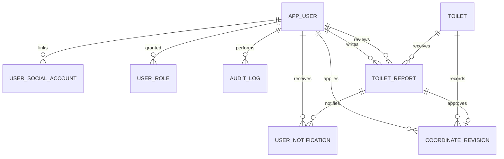

# 운영 데이터 모델 v1.5

> 기준일: 2026-08-31 · 상태: 운영 반영 기준 · DB: MySQL `toilet_db`

## 1. 전체 관계

| 테이블 | 역할 | 실제 DDL 출처 |
| --- | --- | --- |
| `toilet` | 공중화장실 원천·표시 데이터와 최종 좌표 | 기존 초기 스키마 + `V20260826__add_coordinate_metadata.sql` |
| `app_user` | 사용자 기본 정보·상태 | API Flyway `V1__create_auth_data_model.sql` |
| `user_social_account` | Google/Kakao 계정 연결 | API Flyway V1 |
| `user_role` | `USER`/`ADMIN` 역할 | API Flyway V1 |
| `audit_log` | 인증·관리자·승인 감사 이벤트 | API Flyway V1 |
| `toilet_report` | 위치·개방시간 사용자 제보 | API Flyway `V2__create_toilet_report_and_coordinate_revision.sql` |
| `coordinate_revision` | 승인된 좌표·주소 변경 이력 | API Flyway V2 |
| `user_notification` | 제보 승인·반려 결과의 사이트 내 알림 | API Flyway `V4__create_user_notification.sql` |
| `batch_sync_history` | 공공데이터 배치 실행 결과 | Batch `src/main/resources/schema.sql` |

## 2. 테이블 책임과 핵심 컬럼

| 테이블 | 핵심 키/상태 | 데이터 보존 원칙 |
| --- | --- | --- |
| `toilet` | `toilet_id`, `mng_no`, `coordinate_source` | 관리자 확정 좌표(`ADMIN_CONFIRMED`)는 배치가 갱신하지 않음 |
| `app_user` | `user_id`, `status` | 이메일은 선택 보조 정보이며 로그인 식별의 기준이 아님 |
| `user_social_account` | `(provider, provider_subject_hash)` 유니크 | 제공자 고유 ID의 해시로 동일 사용자를 식별 |
| `user_role` | `(user_id, role)` PK | 최소 `USER`, 운영자는 추가 `ADMIN` |
| `toilet_report` | `status`, `active_request_key` | 처리 중인 동일 사용자·화장실·유형 제보 중복 방지 |
| `coordinate_revision` | `report_id` 유니크 | 승인 전후 좌표·도로명 주소를 삭제하지 않고 기록 |
| `audit_log` | `action`, `target_type`, `target_id` | 개인정보·토큰 원문은 detail에 기록하지 않음 |
| `user_notification` | `notification_id`, `user_id`, `report_id`, `read_at` | 사용자 본인의 알림만 조회·읽음 처리하며 `(user_id, report_id, type)`으로 중복 생성 방지 |
| `batch_sync_history` | `status`, `started_at` | 수신·신규·수정·실패 건수와 실패 사유를 운영 조회용으로 기록 |

상세 컬럼은 [Toilet 테이블 명세](toilet-table.md), [제보·좌표 승인 모델](user-report-coordinate-model.md), [인증 모델](../planning/authentication-authorization-design.md)을 각각의 도메인 기준으로 참조한다.

## 3. DDL 적용 순서

| 순서 | 적용 주체 | 내용 | 주의 사항 |
| --- | --- | --- | --- |
| 1 | 초기 DB | `toilet` 기본 테이블 | 기존 운영 데이터 기반 |
| 2 | 운영 DDL | 좌표 메타데이터 3개 컬럼 | 2026-08-26 운영 반영 완료 |
| 3 | API Flyway V1 | 사용자·소셜·역할·감사 로그 | API는 `ddl-auto=validate`로 스키마를 검증 |
| 4 | API Flyway V2 | 제보·좌표 수정 이력 | V1 이후 자동 적용 |
| 5 | Batch SQL init | `batch_sync_history` | 배치 실행 이력 전용 테이블 |
| 6 | API Flyway V4 | 사이트 내 제보 결과 알림 | 승인·반려 트랜잭션에서 생성 |

신규 환경은 위 순서를 지킨다. 운영 DB에 문서의 SQL을 직접 재실행하지 않으며, API 변경은 Flyway migration으로 추가한다.

## 4. 스키마 운영 정책

- `toilet-api`는 Flyway를 기준으로 마이그레이션을 적용하고 `validate`로 불일치를 막는다.
- `toilet-batch`와 `toilet-admin-api`는 현재 각 실행에 필요한 보조 테이블 모델을 유지한다. DDL의 단일 출처를 강화할 필요가 생기면 `batch_sync_history`도 API Flyway로 이관하는 별도 작업을 진행한다.
- 모든 시간 컬럼은 운영 시간대 `Asia/Seoul`을 기준으로 표시하며, 배치는 매일 02:00 KST에 실행한다.
- DB와 Redis는 Docker 내부망만 사용한다. 외부 클라이언트는 API를 통해서만 데이터에 접근한다.

## 변경 이력

| 버전 | 일자 | 변경 |
| --- | --- | --- |
| v1.5 | 2026-08-31 | `user_notification`과 제보 처리 결과 알림의 소유권·중복 방지·읽음 정책 추가 |
| v1.4 | 2026-08-31 | 인증·제보·좌표 이력·배치 이력을 포함한 전체 운영 스키마와 실제 DDL 출처 정비 |
