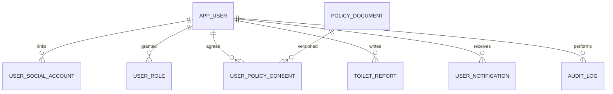

# 운영 데이터 모델 v1.7

> 기준일: 2026-09-01 · 상태: 정책·동의 모델 구현 기준 · DB: MySQL `toilet_db`

## 1. v1.6 이후 변경

- `policy_document`: 정책 종류별 버전, 시행일, 필수 여부와 공개 경로를 관리한다.
- `user_policy_consent`: 사용자가 동의한 정확한 정책 버전과 시각, 경로, 철회 시각을 관리한다.
- 신규 OAuth 사용자의 초기 상태를 `PENDING_CONSENT`로 두고 모든 필수 동의가 저장되면 `ACTIVE`로 전환한다.
- 회원 탈퇴 시 `WITHDRAWN`으로 전환하고 소셜 연결·역할·Redis 세션을 폐기한다.

## 2. 관계

기존 화장실·제보·알림·좌표 품질·배치 이력 관계는 [v1.6](database-schema-v1.6.md)을 그대로 계승한다.

## 3. 신규 테이블

### `policy_document` — 정책 버전

| 컬럼 | 한글 속성명 | 설명 |
| --- | --- | --- |
| `policy_document_id` | 정책 문서 식별자 | 내부 기본키 |
| `policy_key` | 정책 종류 | 이용약관, 개인정보 수집, 14세 확인, 처리방침, 위치 안내 |
| `version` | 정책 버전 | 사용자 동의가 연결되는 불변 버전 |
| `title` | 표시 제목 | 동의 화면·정책 화면 제목 |
| `required` | 필수 여부 | 회원 기능 활성화에 필요한지 여부 |
| `effective_at` | 시행일 | 정책 효력 시작일 |
| `content_path` | 공개 경로 | 로그인 없이 열람 가능한 Web 경로 |
| `active` | 현재 적용 여부 | 최신 적용 버전 여부 |
| `created_at` | 생성 시각 | 정책 레코드 생성 시각 |

`UNIQUE(policy_key, version)`을 적용한다. 정책을 수정할 때 기존 행을 덮어쓰지 않고 새 버전을 추가한 뒤 최신 행만 `active = TRUE`로 둔다.

### `user_policy_consent` — 사용자 정책 동의

| 컬럼 | 한글 속성명 | 설명 |
| --- | --- | --- |
| `user_policy_consent_id` | 동의 식별자 | 내부 기본키 |
| `user_id` | 사용자 식별자 | 동의한 `app_user` |
| `policy_document_id` | 정책 문서 식별자 | 동의한 정확한 정책 버전 |
| `consent_source` | 동의 경로 | 현재 `WEB_OAUTH_ONBOARDING` |
| `agreed_at` | 동의 시각 | KST 기준 동의 완료 시각 |
| `withdrawn_at` | 철회 시각 | 탈퇴·철회 전에는 `NULL` |

`UNIQUE(user_id, policy_document_id)`으로 중복 동의를 막고 재동의 시 동의 시각과 경로를 갱신한다.

## 4. 계정 상태

| 상태 | 의미 | 허용 범위 |
| --- | --- | --- |
| `PENDING_CONSENT` | OAuth 인증은 완료했지만 최신 필수 동의가 없음 | 정책 조회·동의·로그아웃 |
| `ACTIVE` | 최신 필수 동의 완료 | 제보·알림·내 계정 포함 회원 기능 |
| `SUSPENDED` | 운영 정책으로 이용 정지 | 인증 회원 기능 차단 |
| `WITHDRAWN` | 탈퇴 완료 | 로그인·토큰 갱신 차단 |

기존 `ACTIVE` 사용자라도 최신 필수 정책 동의 이력이 없으면 `/auth/me`에서 `consentRequired = true`를 반환하고 재동의를 요구한다.

## 5. Flyway 적용

| 순서 | migration | 내용 |
| --- | --- | --- |
| 1~6 | 기존 V1~V6 | 인증, 제보, 감사 검색, 알림, 좌표 품질, KST 정규화 |
| 7 | `V7__create_policy_consent_model.sql` | 정책 버전·동의 이력 테이블과 v1.0 정책 seed |

운영 DB에 문서 SQL을 직접 실행하지 않고 `toilet-api` 배포 시 Flyway가 적용한다. JPA는 `ddl-auto=validate`로 실제 스키마와 모델 불일치를 차단한다.

## 변경 이력

| 버전 | 일자 | 변경 |
| --- | --- | --- |
| v1.7 | 2026-09-01 | 정책 버전, 사용자 동의·철회, 가입 대기·탈퇴 상태와 V7 적용 순서 추가 |
| v1.6 | 2026-08-31 | 동일 좌표 그룹 품질 검토와 직접 보정 이력 추가 |
