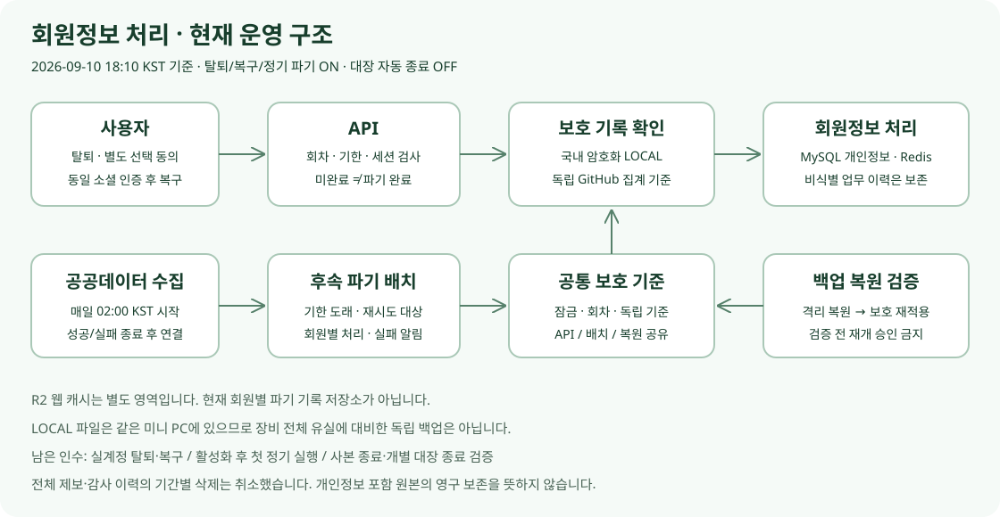

# 회원 탈퇴·복구 / 국내 LOCAL 보호 — 현재 운영 기준

기준: **2026-09-10 18:10 KST 검증**. 정책은 17:45 공개 배포, 18:00 시행. 배치 18:06 → API 18:09 순으로 별도 승인 후 활성화했다. 이 문서는 현재 상태를 설명하며, 과거 R2 준비 보고서나 기능 OFF 기록보다 우선한다. 법률 자문 또는 모든 이용자의 고지 열람 증명이 아니다.

## 현재 켜진 기능과 꺼진 기능

| 기능 | 상태 / 경계 |
| --- | --- |
| 탈퇴·3개월 선택 보관·명시적 복구 | 운영 ON. 보관 동의 기본 미선택, 로그인·정책 공개만으로 동의 처리하지 않음 |
| 회원정보 파기 | 미동의·삭제 요청은 즉시 시도, 실패/미완료는 대기·재시도. 기한 만료는 정기 배치 |
| 정기 파기 | 매일 02:00 KST 공공데이터 수집 시도의 종료 후 실행. API 타이머·DB event·수동 동기화에 연결하지 않음 |
| 국내 암호화 보호 기록 / 독립 기준 / 공통 잠금 | 운영 ON. API·배치·복원 도구가 같은 기준을 사용 |
| 보호 대장 자동 종료 | OFF. 사본 소멸·DB 부재·최신 증거·개별 승인은 별도 |
| 전체 제보 3년 삭제 / 감사 이력 기간 삭제 / 전역 로그 90일 전환 | 사용자 범위 정정으로 취소. 회원 개인정보 파기와 혼합하지 않음 |

업무 이력 보존은 개인정보가 든 원본 로그를 영구 보관한다는 뜻이 아니다. 기존 파일의 모든 물리적 영구 보존을 보장하거나 저장소 전체 보관 정책을 새로 변경하지 않았다.

## 사용자 흐름과 실제 API

로그인 → 홈페이지의 **내 계정** → 탈퇴 안내 → 선택 보관 여부 → 탈퇴. `/account` 독립 페이지는 없다.

| 요청 | 의미 |
| --- | --- |
| GET `/api/v1/auth/withdrawal-options` | 로그인 필요. 가능 여부·동의 버전·예상 기한 조회 |
| DELETE `/api/v1/auth/me` | `retainForRecovery`, 선택한 경우 `consentVersion`; 보관/파기 요청 |
| GET `/api/v1/auth/recovery` | 동일 소셜 재인증 후 확인 쿠키로 복구 가능 상태 조회 |
| POST `/api/v1/auth/recovery` | `RESTORE` 또는 `ERASE` 명시 선택 |
| DELETE `/api/v1/auth/recovery` | 확인 취소. 계정 상태 변경 아님 |

- 별도 동의한 경우만 탈퇴부터 **달력상 3개월** 보관한다. 90일 고정이 아니다.
- 이메일·일반 로그인 토큰은 복구용으로 보관하지 않는다. 소셜 식별 연결·닉네임·회원/제보 연결 등 실제 안내 항목만 대상이다.
- 같은 소셜 고유 계정으로 인증하고 명시적으로 복구한다. 이메일 일치나 단순 로그인으로 자동 복구하지 않는다. ADMIN 권한은 자동 복원하지 않는다.
- 미동의·삭제 요청·기한 만료 시 복구를 허용하지 않는다. HTTP 202 대기는 파기 완료가 아니다.
- 제보의 구조화된 수정 정보·처리 상태·행위/시각 이력은 유지하고 회원 연결·개인정보 포함 자유 입력/상세 값은 해당 파기 로직에 따라 제거한다. 화장실 원본 좌표·주소를 회원 탈퇴 때문에 삭제하지 않는다.
- 기존 방식 탈퇴 계정에 동의·복구 기한을 소급 생성하지 않는다. 별도 검토 대상으로 남긴다.

## 저장소를 혼동하지 않기

| 저장소 | 목적 | 한계 |
| --- | --- | --- |
| MySQL | 회원·탈퇴 회차/기한·제보/감사 업무 데이터 | DB 삭제만으로 백업까지 사라지지 않음 |
| Redis | 로그인 리프레시 세션·복구 확인 | 비영속. 재시작 후 재로그인 필요; 현재 프로세스는 정상 운영 |
| 국내 서버의 별도 암호화 LOCAL 파일 | 파기 의도·목록·완료/재생 방지 보호 기록 | 같은 미니 PC 전체 유실에 대비한 독립 백업은 아님 |
| 비공개 GitHub 독립 기준 | 집계 건수·해시·DB 복원 세대·연결 기준 | 회원별 원문/비밀키 저장 안 함. WORM/무조건 append-only 아님 |
| 현재 SQL 백업·binlog | 복구 및 변경 기록 | 사본 종료를 실제 검증해야 함 |
| Cloudflare R2 프론트 캐시 | Next.js ISR 등 공개 웹 캐시 | 회원 파기 대장과 별개; 이번 전환에서 폐기하지 않음 |

옛 R2 회원 대장 준비안은 LOCAL로 대체했다. 기존 외부 준비 저장소의 잔여 데이터·키·토큰 정리 여부는 별도 확인 대상이며, 이번 문서 수정으로 삭제하거나 부재를 확정하지 않는다. 국외 이전 답변 대기를 LOCAL 탈퇴 기능의 선행 조건으로 남겨 두지 않는다.

## 파기·백업·복원 보호

1. API·배치 writer와 복원 도구의 공통 유지보수 잠금 및 DB 상태/회차를 확인한다.
2. 암호화 파기 의도와 목록, 독립 기준의 연결을 검증한다. 실패를 0건 또는 성공으로 대체하지 않는다.
3. 해당 회원 세션·개인정보를 처리하고 완료/재시도 결과를 구분한다. 외부 저장소와 MySQL이 하나의 트랜잭션이라고 가정하지 않는다.
4. 백업 복원본은 보호 기록 재적용·부재/일관성 확인 전 서비스 재개 근거로 승격하지 않는다.
5. 대장 종료는 별도 승인 작업이다. 기존 도구의 32일 최소 검토 기준은 법정 기간이나 32일 자동 삭제 보장이 아니다. 남은 사본·실제 만료·재등장·독립 기준·키 복구·최신 증거를 함께 확인한다.

정기 운영은 03:15 암호화 백업 → 03:35 격리 복원 → 04:15 삭제 없는 보관 점검이다. 설정/타이머 존재, 수동 실행 성공, 자연 예약 성공, 실제 회원 파기를 구분한다.

### 이미 승인받아 정리한 과거 사본

- 9월 9일: 구형 암호화 백업 10개와 체크섬 10개. 당시 보존한 최신 5개 백업 및 부속 파일의 해시 불변 확인.
- 9월 10일: 미사용 Redis 볼륨의 RDB/AOF 4개, 총 55,173 bytes. 현재 Redis 연결·세션 유지 확인.
- 9월 10일: 확인·승인된 미사용 MySQL 볼륨 7개. 운영 컨테이너·현재 백업 불변 확인.

이 기록은 과거 승인된 논리 삭제 결과다. 이번 문서 작업에서는 삭제를 수행하지 않는다. 물리 매체 완전 소거 또는 현재 모든 사본의 부재를 뜻하지 않는다. 운영 binlog는 30일 설정과 동일 이미지의 격리 만료 시험을 확인했지만 실제 운영 30일 만료 제거 관측은 아직 별도다.

## 배포·테스트 근거

| 단계 | 근거 |
| --- | --- |
| V11·기본 계정 구현 | [API #86](https://github.com/toilet-project/toilet-api/pull/86), [batch #38](https://github.com/toilet-project/toilet-batch/pull/38); [DDL 설명](../database/account-withdrawal-retention-v1.11.md) |
| LOCAL·잠금·복원/종료 프로토콜 준비 | [API #99](https://github.com/toilet-project/toilet-api/pull/99), [batch #47](https://github.com/toilet-project/toilet-batch/pull/47) |
| 보호 유지 이미지 배포 | [API 성공](https://github.com/toilet-project/toilet-api/actions/runs/34456003500), [batch 성공](https://github.com/toilet-project/toilet-batch/actions/runs/34456267846) |
| 정책·UI 공개 | [WEB #199](https://github.com/toilet-project/toilet-web/pull/199), [Workers CI](https://github.com/toilet-project/toilet-web/actions/runs/34455296235) |
| 실제 활성화 | [batch 18:06](https://github.com/toilet-project/toilet-batch/actions/runs/34458586916), [API 18:09](https://github.com/toilet-project/toilet-api/actions/runs/34458867070) |

- 보호 유지 최종 이미지 빌드: 각 Linux 전환 테스트 34건과 전체 Gradle test/bootJar 성공.
- 공개 API·OAuth/CORS 9경로와 비로그인 탈퇴 안내 401 확인. 서비스 연결 검사이지 사용자 실제 OAuth 왕복/탈퇴 시험은 아니다.
- API/batch 실제 active, Redis 연결·공통 보호 설정 일치, 대장 자동 종료 OFF 확인. 사용한 활성화 승인 변수는 닫았다.
- 최종 집계: 새 탈퇴 회차·기한 도래 0건. 기존 방식 탈퇴 2건은 별도 검토. 0건을 실회원 파기 실적으로 계산하지 않는다.
- 합성 UI 375×667 / 1440×900 회귀 통과. 지정 실계정 Google/Kakao 탈퇴·복구는 미실행이다.

## 운영 변경 시 주의

API/batch의 예전 paused 전용 `deploy.yml`은 비활성화했다. 이미지 교체는 `account-preserving-rollout.yml`로 정확한 커밋·다이제스트와 현재 상태를 확인한다. 활성화 workflow와 대장 종료를 혼합하지 않는다. 설정 롤백은 이미 삭제한 개인정보를 복구하지 못한다.

독립 기준 토큰·암호화 키 회전, 규모 상한/전체 대장 검증 비용, 실제 복원 서비스 재개 인수는 후속 검토다. 상태 확인용 읽기 도구의 `activationAllowed=false`는 그 도구가 설정을 변경하지 않는다는 뜻이며 운영 기능 OFF를 뜻하지 않는다.

## 남은 인수

- [ ] 지정된 본인 소유 Google/Kakao 계정의 실제 선택 동의·탈퇴·복구·미동의 파기·취소·재가입·작성자 표시 확인.
- [ ] 9월 10일 18시 활성화 이후 첫 자연 정기 파기 실행 확인. 같은 날 새벽 성공으로 대체하지 않음.
- [ ] 실제 운영 사본 종료 증거와 필요한 회원 보호 기록의 개별 종료 인수.
- [ ] 과거 외부 준비 자원 잔여 확인 및 키/토큰 수명주기·장기 규모 대응.

[WBS 전체 판정](wbs-audit-2026-09-10.md). 일반 회원 계정이나 운영 장애를 임의로 테스트하지 않는다.
