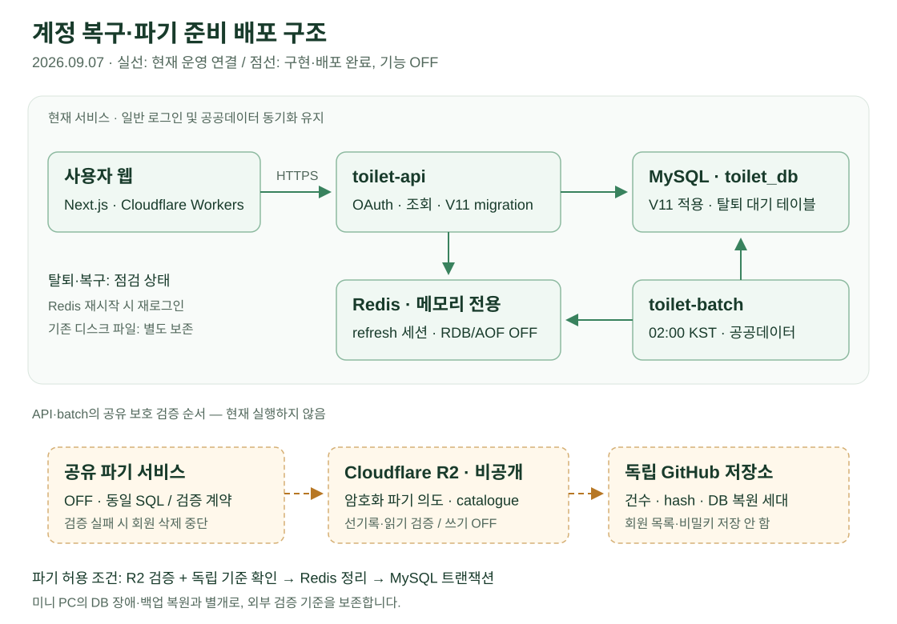
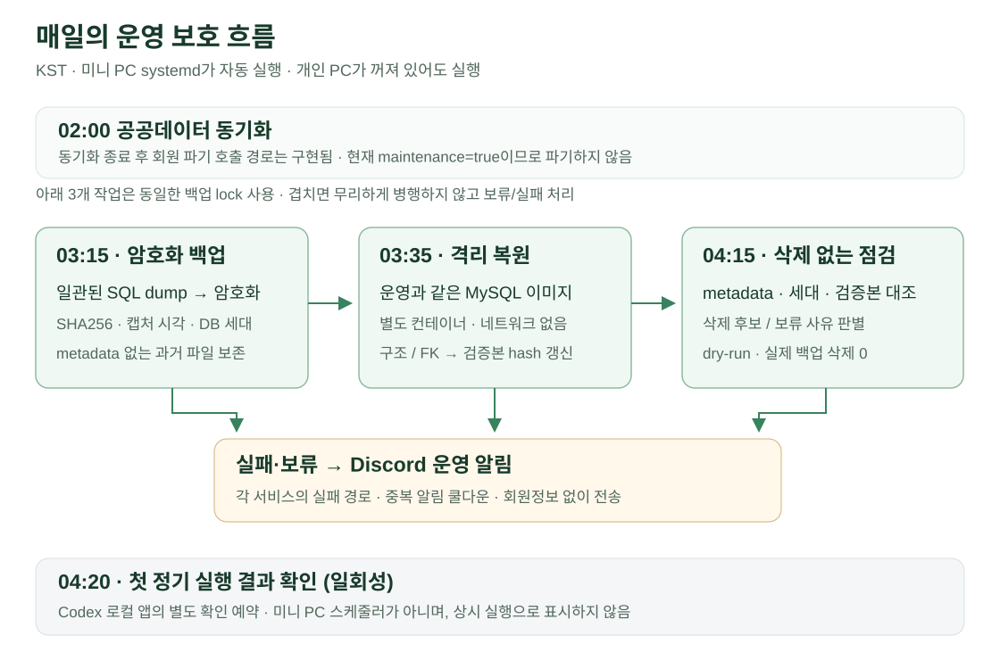
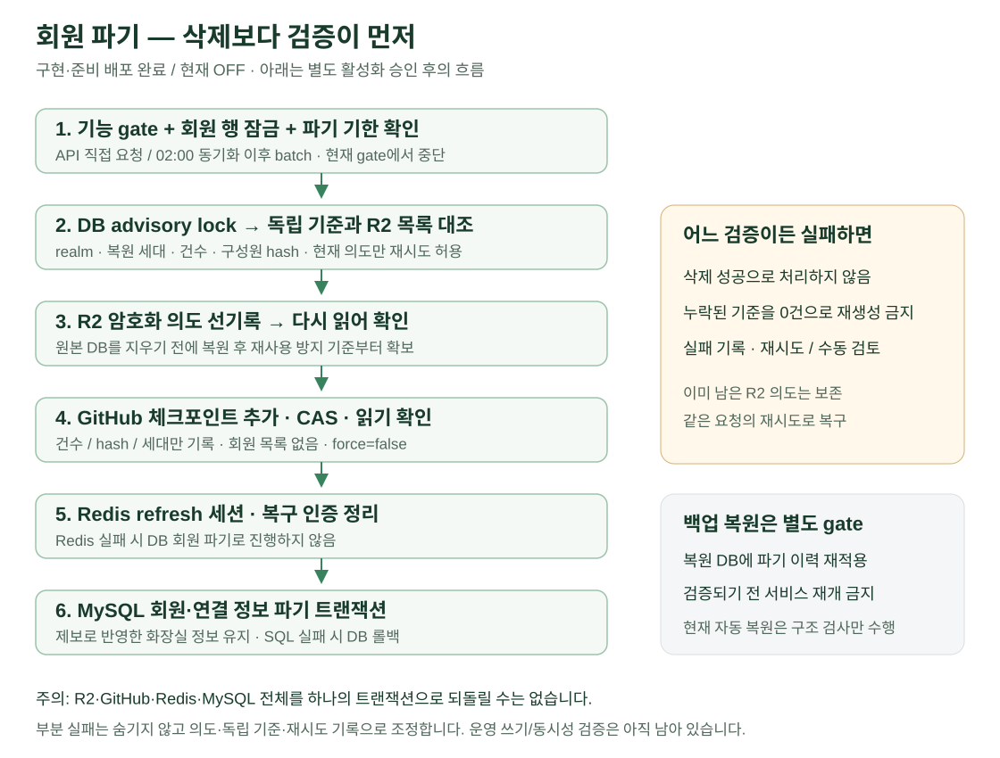

# 계정 복구·파기 / 백업 보호 — WBS 통합 안내

기준: **2026-09-07 01:47 KST 운영 검증 + 사용자 로그인 복귀 확인**. 이후 정기 실행 결과를 추정해서 완료 처리하지 않는다.

> 현재: API·batch·V11·Redis 준비 배포 완료. 일반 로그인·지도·공공데이터 동기화 유지. **탈퇴·계정 복구는 점검 상태이며, 회원 파기·R2 쓰기·독립 체크포인트 추가는 OFF**.

## 왜 이 작업을 나눴나

계정 탈퇴는 DB 한 행 삭제로 끝나지 않는다. 세션, 제보/감사 이력의 회원 연결, 복원용 백업, 외부 파기 기록까지 영향을 준다. **구현 완료 → 준비 배포 → 운영 검증 → 정책·화면 공개 → 활성화**를 구분해, 코드가 배포됐다는 이유로 실제 삭제가 켜졌다고 오해하지 않게 관리한다.

[Organization Project WBS](https://github.com/orgs/toilet-project/projects/2). 제목 `[W4·분류]`는 개발 4주차와 담당 영역을 뜻하며, 시작일/종료일은 실제 기록으로 별도 관리한다. 체크한 항목은 검증 근거가 있는 범위만 의미한다.

## 1. 현재 운영 구조

- 사용자 웹은 이미 Next.js/Workers로 운영 중이다. 이번 릴리스는 웹 구조 변경이 아니라 API·batch·DB·Redis 준비 배포다.
- API가 Flyway V11을 소유하며 batch나 문서 SQL로 중복 migration하지 않는다.
- Redis는 메모리 전용이다. 재시작하면 refresh 세션은 사라지며 이미 발급된 access JWT의 즉시 무효화와는 다르다.
- R2는 암호화된 파기 의도·catalogue를 위한 저장소다. **일반 SQL 백업을 R2로 이전한 것이 아니다.** 암호화 SQL 백업은 미니 PC에 보관한다.
- 독립 비공개 GitHub에는 구성원 목록 없이 집계 건수·hash·DB 복원 세대를 기록한다. R2 전체 유실을 빈 기준으로 오판하지 않기 위한 별도 비교 기준이다.

## 2. 매일의 운영 흐름

| 시각 KST | 실행 주체 | 작업 | 현재 판정 |
| --- | --- | --- | --- |
| 02:00 | Spring batch | 공공데이터 동기화. 종료 후 회원 파기 호출 경로 | 공공데이터 유지 / 파기 gate OFF |
| 03:15 | 미니 PC systemd | 암호화 백업 + metadata | 설치·수동 실행 검증 완료 / 첫 정기 결과 미확인 |
| 03:35 | 미니 PC systemd | 격리 MySQL 복원·FK 검사·보호 hash 갱신 | 설치·실제 백업 복원 검증 완료 / 첫 정기 결과 미확인 |
| 04:15 | 미니 PC systemd | 삭제 없는 보관 점검, 보류/실패 알림 | 설치·보류 경로 확인 / 실제 백업 삭제 OFF |
| 04:20 | 로컬 Codex 앱 | 첫 정기 실행 결과 읽기 전용 확인 | 일회성 예약. 미니 PC의 상시 스케줄러가 아님 |

백업·복원·점검은 같은 lock을 쓴다. 실패 또는 겹침을 무시하고 다음 단계의 성공으로 처리하지 않는다. Discord 알림은 중복 억제 쿨다운이 있으므로 새 메시지가 없다는 사실만으로 미실행/성공을 단정하지 않는다. 격리 복원의 구조 검증은 **파기 기록을 재적용한 뒤 서비스 재개가 가능한지 검증하는 절차와 별개**다.

## 3. 활성화 후의 회원 파기 흐름 — 현재 실행 안 함

API와 batch는 같은 보호 계약을 사용한다. DB 행·기한을 확인한 뒤 R2와 독립 기준을 검증하고, **R2 선기록 → 독립 체크포인트 확인 → Redis 정리 → MySQL 파기** 순서로 처리한다. 외부 저장소와 DB 전체에 걸친 단일 트랜잭션은 아니므로 부분 기록은 남을 수 있다. 정확히 같은 파기 의도만 재시도로 복구하며 다른 회원의 누락을 덮어쓰지 않는다.

탈퇴·복구 정책안은 별도 선택 동의가 있을 때만 달력상 3개월 복구 정보를 보관한다. 이메일·로그인 토큰은 복구용 보관 대상이 아니다. 복구 시 ADMIN을 자동 복원하지 않는다. 이 내용은 **아직 공개·활성화되지 않은 구현안**이며, 법률 적합성 확인이나 과거 사본 파기 완료를 의미하지 않는다.

## 4. 기능별 WBS

| 코드 | 분류 | 항목 | 상태 / 완료 범위 |
| --- | --- | --- | --- |
| A | API | 계정 복구·파기 백엔드 및 V11 준비 배포 | 완료 — 구현·준비 배포, 기능 활성화 제외 |
| B | BATCH | 공공데이터 후속 회원 파기 배치 구현 | 완료 — gate·재시도·준비 배포, 실회원 파기 제외 |
| C | BATCH | 암호화 백업·격리 복원·삭제 없는 점검 자동화 | 완료 — 설치·수동 검증, 첫 정기 인수는 G |
| D | API | R2 파기 대장·독립 체크포인트 보호 계층 | 완료 — 구현·인증 읽기·준비 배포, 운영 쓰기 인수는 G |
| E | API | Redis 비영속 전환·배포 복구 안전장치 | 완료 — 디스크 연결 분리·로그인 확인, 과거 파일 정리는 H |
| F | WEB | 탈퇴 선택 동의·복구 화면 및 정책 공개 | 진행중 — feature UI 있음, 운영 공개·최종 고지 미완료 |
| G | BATCH | 첫 정기 인수·회원 파기 활성화 검증 | 진행중 — 예약·준비 배포 확인, 정기 결과·실제 쓰기 미확인 |
| H | DOCS | 기존 사본·파기 대장 보관 정책 및 안전 정리 | 진행중 — 현황 조사·보존 완료, 최종 정책·승인 삭제 미완료 |

의존 관계: A+B+D+E 준비 배포 → C 정기 인수 → F 정책/화면 공개 및 H 보관·복원 경계 확정 → G 별도 활성화 승인·검증. G에는 선행 작업의 상태를 확인하는 인수 체크만 두고, F/H 작업 자체를 중복 완료 처리하지 않는다.

## 5. 실제 릴리스와 검증 근거

| 근거 | 확인 내용 |
| --- | --- |
| [API PR #86](https://github.com/toilet-project/toilet-api/pull/86) / [배포](https://github.com/toilet-project/toilet-api/actions/runs/34046244587) | main `fc66cd1` · V11 성공 · API 정상 기동 |
| [batch PR #38](https://github.com/toilet-project/toilet-batch/pull/38) / [배포](https://github.com/toilet-project/toilet-batch/actions/runs/34046447648) | main `f174f5d` · 정상 기동 · Redis 네트워크 PING |
| [Redis·V11 CI](https://github.com/toilet-project/toilet-api/actions/runs/34045959058) | 격리 Redis 재시작·세션 소멸·tmpfs 검사 및 API 회귀 |
| [복원 도구 CI](https://github.com/toilet-project/docs/actions/runs/34044637719) | Linux 합성 46/46 통과 |
| [독립 기준 실제 읽기 CI](https://github.com/toilet-project/toilet-batch/actions/runs/34045385160) | 지정 비공개 저장소 인증·세대 확인, 쓰기 없음 |
| [2~4단계 당시 결과](account-erasure-stages-2-to-4-2026-09-07.md) | 공유 보호 계층, 복원 설치, 사본·정책 조사 |
| [5단계 운영 결과](account-erasure-stage-5-preparation-2026-09-07.md) | 새 암호화 백업·격리 복원 후 API/Redis/batch 배포 및 로그인 확인 |

### 운영에서 발견하고 해결한 사항

1. **Redis 이전 볼륨 승계**: tmpfs가 실제 사용 중이어도 inspect에 과거 named volume이 남았다. 컨테이너만 재생성해 연결을 제거하고 파일 4개는 보존했다. CI의 신규 생성 검사와 운영 전환 검사를 구분한다.
2. **Docker 서비스 이름**: 일반 Docker는 이중 엔진 방지를 위해 masked였다. 자동 복원 유닛은 실제 Snap Docker에 의존하도록 수정했다.
3. **과거 백업 metadata 누락**: 10개 파일을 임의 정상 판정하거나 자동 삭제하지 않고 보류했다. 검증된 새 백업만 hash 갱신 대상으로 삼는다.
4. **외부 조회 도구 실패**: Python HTTP 검사 실패를 서비스 장애로 단정하지 않고 curl의 내·외부 200으로 재확인했다.

### 남은 위험

실제 R2/GitHub 쓰기·동시성·부분 실패 인수, 사용자 보관 키로 복원하는 경로, 정책 시행·외부 저장 고지, 과거 Redis/백업/binlog 정리 근거는 남아 있다. GitHub는 WORM이 아니며 토큰 만료·보호 정책 제한이 있다. 현재 전체 대장 대조는 O(N)이므로 규모가 커지기 전 재설계가 필요하다. 14/30/32일 기술 검토 기간을 법적 유예 기간으로 표현하지 않는다.
