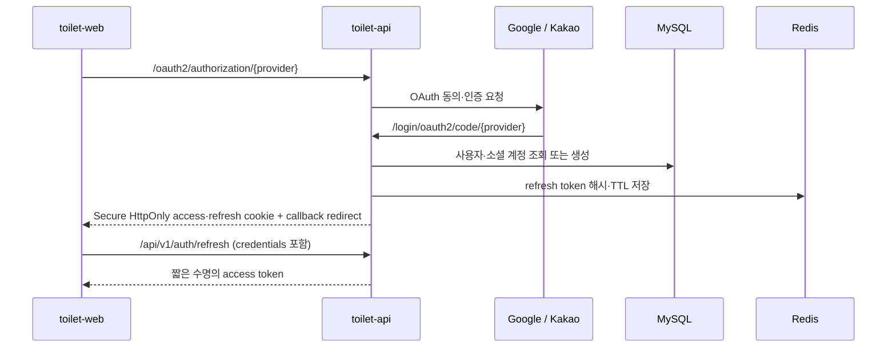
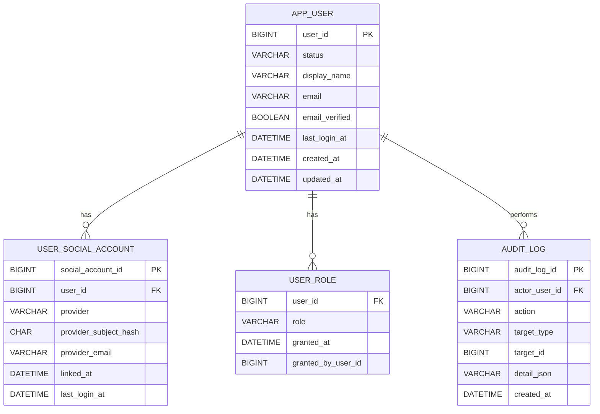

# 인증·권한 정책 및 데이터 모델 설계 v1.3

> 대상: 급똥 웹·API·관리자 운영 기능  
> 상태: Google·Kakao OAuth, JWT 쿠키, Redis refresh 세션, USER/ADMIN 인가 운영 반영 완료
> 작성일: 2026-08-31

## 1. 결정 사항

- 별도 인증 서버는 만들지 않는다. `toilet-api`가 Spring Security OAuth2 Client를 사용해 Google·Kakao 로그인을 처리한다.
- 일반 사용자는 `USER`, 운영 담당자는 `ADMIN` 역할을 가진다. `ADMIN`은 Cloudflare Access 통과와 애플리케이션 역할 검증을 모두 만족해야 한다.
- 지도·화장실 조회는 비로그인으로 유지한다. 로그인은 제보, 제보 상태 조회, 관리자 기능부터 요구한다.
- 짧은 수명의 access token은 JWT로 발급해 HttpOnly Secure 쿠키로 전달한다. 갱신용 refresh token은 암호학적 난수로 만들고 Redis에 해시와 TTL을 저장한다. 브라우저 저장소에는 어떤 토큰도 저장하지 않는다.
- Google·Kakao의 계정 식별자는 이메일이 아닌 `(provider, provider_subject_hash)` 조합을 기준으로 연결한다. 제공자 고유값은 HMAC-SHA-256으로 변환해 저장하며, 이메일은 제공되지 않거나 변경될 수 있으므로 보조 정보로만 저장한다.

## 2. 인증 흐름



### 토큰 정책

| 구분 | 정책 |
| --- | --- |
| Access token | 15분 만료, `geupddong_access` HttpOnly Secure 쿠키(`Path=/`)로 전달 |
| Refresh token | 14일 만료, 회전 방식, Redis에 원문 대신 SHA-256 해시와 TTL 저장 |
| Refresh cookie | `geupddong_refresh`, `HttpOnly`, `Secure`, `SameSite=Lax`, `Path=/api/v1/auth` |
| 로그아웃 | 해당 refresh token을 즉시 폐기하고 쿠키 만료 |
| 재사용 탐지 | 이미 폐기된 refresh token 사용 시 Redis의 해당 사용자 세션을 모두 폐기 |

`https://geupddong.com`에서 `https://api.geupddong.com`을 호출하므로, API의 CORS는 운영 웹 Origin 하나만 허용하고 `allowCredentials`를 활성화한다. OAuth 완료 후에는 토큰을 URL 쿼리에 넣지 않고 웹의 `/auth/callback`으로 이동한다.

## 3. 역할과 인가 정책

| 자원 | 비로그인 | USER | ADMIN |
| --- | :---: | :---: | :---: |
| 지도·화장실 상세 조회 | 허용 | 허용 | 허용 |
| 로그인·토큰 갱신·로그아웃 | 해당 없음 | 허용 | 허용 |
| 사용자 제보 작성·내 제보 조회 | 불가 | 허용 | 허용 |
| 제보 승인·반려·좌표 확정 | 불가 | 불가 | 허용 |
| 운영 모니터링·배치 이력 | 불가 | 불가 | 허용 |
| 사용자/역할 관리 | 불가 | 불가 | 허용 |

관리자 API는 다음 두 겹으로 보호한다.

1. `admin.geupddong.com`의 Cloudflare Access에서 승인된 운영자 이메일만 통과시킨다.
2. 애플리케이션에서 access token의 `ADMIN` 역할을 확인한다.

Cloudflare Access는 외부 진입을 줄이는 경계이고, 역할 검증은 API가 반드시 수행하는 권한 판단이다. 둘 중 하나만으로 관리자 권한을 부여하지 않는다.

## 4. 데이터 모델



### 테이블별 책임과 제약

| 테이블 | 책임 | 핵심 제약 |
| --- | --- | --- |
| `app_user` | 서비스 사용자 상태와 표시 정보 | `status`: `ACTIVE`, `SUSPENDED`, `WITHDRAWN` |
| `user_social_account` | OAuth 제공자 계정 연결 | `UNIQUE(provider, provider_subject_hash)`, 사용자당 제공자 하나만 연결 |
| `user_role` | 다중 역할 부여 | `PRIMARY KEY(user_id, role)`, 역할: `USER`, `ADMIN` |
| `audit_log` | 관리자·보안 행위의 추적 | 제보 승인/반려, 좌표 확정, 역할 변경, 계정 상태 변경 기록 |

`app_user.email`은 nullable이다. OAuth 제공자가 이메일을 주지 않거나, 사용자가 동의를 철회한 경우에도 `provider_subject_hash`로 사용자를 식별할 수 있어야 한다.

### 컬럼 한글 명세

#### `app_user` — 사용자

| 컬럼 | 한글 속성명 | 설명 |
| --- | --- | --- |
| `user_id` | 사용자 식별자 | 내부 기본키 |
| `status` | 계정 상태 | `ACTIVE`, `SUSPENDED`, `WITHDRAWN` |
| `display_name` | 표시 이름 | 서비스에 표시할 이름 |
| `email` | 이메일 주소 | 제공된 경우에만 저장하는 보조 정보 |
| `email_verified` | 이메일 인증 여부 | OAuth 제공자가 인증 여부를 전달한 경우의 상태 |
| `last_login_at` | 마지막 로그인 일시 | 마지막 인증 성공 시각 |
| `created_at` | 생성 일시 | 계정 최초 생성 시각 |
| `updated_at` | 수정 일시 | 계정 정보 마지막 변경 시각 |

#### `user_social_account` — 소셜 계정 연결

| 컬럼 | 한글 속성명 | 설명 |
| --- | --- | --- |
| `social_account_id` | 소셜 계정 연결 식별자 | 내부 기본키 |
| `user_id` | 사용자 식별자 | 연결된 `app_user` 참조 |
| `provider` | 소셜 로그인 제공자 | `GOOGLE`, `KAKAO` |
| `provider_subject_hash` | 제공자 사용자 고유값 해시 | 제공자가 부여한 식별값을 HMAC-SHA-256으로 변환한 로그인 조회용 해시 |
| `provider_email` | 제공자 이메일 | 제공된 경우에만 보관하는 제공자 프로필 정보 |
| `linked_at` | 연결 일시 | 해당 소셜 계정 최초 연결 시각 |
| `last_login_at` | 제공자 마지막 로그인 일시 | 해당 제공자를 통한 마지막 로그인 시각 |

#### `user_role` — 사용자 역할

| 컬럼 | 한글 속성명 | 설명 |
| --- | --- | --- |
| `user_id` | 사용자 식별자 | 역할을 받은 사용자 |
| `role` | 역할 코드 | `USER`, `ADMIN` |
| `granted_at` | 역할 부여 일시 | 역할이 추가된 시각 |
| `granted_by_user_id` | 역할 부여 관리자 식별자 | 역할을 부여한 관리자, 초기 시스템 부여는 `NULL` 허용 |

#### `audit_log` — 감사 로그

| 컬럼 | 한글 속성명 | 설명 |
| --- | --- | --- |
| `audit_log_id` | 감사 로그 식별자 | 내부 기본키 |
| `actor_user_id` | 행위 사용자 식별자 | 행위를 수행한 사용자·관리자, 시스템 행위는 `NULL` 허용 |
| `action` | 행위 코드 | 예: `REPORT_APPROVED`, `ROLE_GRANTED`, `USER_SUSPENDED` |
| `target_type` | 대상 유형 | 행위 대상의 도메인 유형. 예: `TOILET_REPORT`, `USER` |
| `target_id` | 대상 식별자 | 행위 대상의 내부 식별자 |
| `detail_json` | 추가 상세 정보 | 변경 전후 값 등 최소한의 감사 정보 |
| `created_at` | 기록 일시 | 감사 로그 생성 시각 |

### Redis 세션 키 정책

refresh token은 영구 데이터가 아니라 만료되는 로그인 세션이므로 MySQL 테이블을 만들지 않는다. Redis가 재시작되거나 키가 사라지면 해당 사용자는 다시 로그인한다.

| 키 패턴 | 값 | TTL | 용도 |
| --- | --- | --- | --- |
| `auth:refresh-token:{tokenHash}` | `userId` | 14일 | refresh token 검증·폐기 |
| `auth:user-sessions:{userId}` | tokenId Set | refresh token 최대 TTL과 동일 | 로그아웃 전체·재사용 탐지 시 사용자 세션 일괄 폐기 |
| `auth:login-attempt:{provider}:{subjectHash}` | 실패 횟수 | 10분 | 향후 로그인 시도 제한 |

Redis 값에는 OAuth 응답·JWT·refresh token 원문을 넣지 않는다. `tokenHash`는 SHA-256 해시를 사용한다. 사용자별 세션 목록과 재사용 탐지는 실제 token refresh/rotation endpoint를 구현하는 WBS에서 추가한다.

### MySQL DDL (Flyway V1 적용)

아래 DDL은 `V1__create_auth_data_model.sql`로 운영 반영되었다. 운영 DB에 문서의 SQL을 직접 재실행하지 않는다.

```sql
CREATE TABLE app_user (
    user_id BIGINT NOT NULL AUTO_INCREMENT,
    status VARCHAR(20) NOT NULL DEFAULT 'ACTIVE',
    display_name VARCHAR(100) NULL,
    email VARCHAR(255) NULL,
    email_verified BOOLEAN NOT NULL DEFAULT FALSE,
    last_login_at DATETIME NULL,
    created_at DATETIME NOT NULL DEFAULT CURRENT_TIMESTAMP,
    updated_at DATETIME NOT NULL DEFAULT CURRENT_TIMESTAMP ON UPDATE CURRENT_TIMESTAMP,
    PRIMARY KEY (user_id),
    KEY idx_app_user_status (status)
);

CREATE TABLE user_social_account (
    social_account_id BIGINT NOT NULL AUTO_INCREMENT,
    user_id BIGINT NOT NULL,
    provider VARCHAR(20) NOT NULL,
    provider_subject_hash CHAR(64) NOT NULL,
    provider_email VARCHAR(255) NULL,
    linked_at DATETIME NOT NULL DEFAULT CURRENT_TIMESTAMP,
    last_login_at DATETIME NULL,
    PRIMARY KEY (social_account_id),
    UNIQUE KEY uk_social_provider_subject_hash (provider, provider_subject_hash),
    UNIQUE KEY uk_social_user_provider (user_id, provider),
    CONSTRAINT fk_social_user FOREIGN KEY (user_id) REFERENCES app_user (user_id)
);

CREATE TABLE user_role (
    user_id BIGINT NOT NULL,
    role VARCHAR(30) NOT NULL,
    granted_at DATETIME NOT NULL DEFAULT CURRENT_TIMESTAMP,
    granted_by_user_id BIGINT NULL,
    PRIMARY KEY (user_id, role),
    CONSTRAINT fk_role_user FOREIGN KEY (user_id) REFERENCES app_user (user_id)
);

CREATE TABLE audit_log (
    audit_log_id BIGINT NOT NULL AUTO_INCREMENT,
    actor_user_id BIGINT NULL,
    action VARCHAR(100) NOT NULL,
    target_type VARCHAR(50) NOT NULL,
    target_id BIGINT NULL,
    detail_json JSON NULL,
    created_at DATETIME NOT NULL DEFAULT CURRENT_TIMESTAMP,
    PRIMARY KEY (audit_log_id),
    KEY idx_audit_actor_created (actor_user_id, created_at),
    KEY idx_audit_target (target_type, target_id)
);
```

## 5. 사용 라이브러리와 운영 구성

현재 `toilet-api`는 Spring Boot의 dependency management를 사용하므로, 아래 라이브러리는 개별 버전을 고정하지 않고 Spring Boot BOM이 호환 버전을 관리한다.

| 구분 | 라이브러리 / 구성 | 책임 |
| --- | --- | --- |
| 인증 | `spring-boot-starter-security` | SecurityFilterChain, 역할 인가, 비밀번호 없는 인증 경계 |
| 소셜 로그인 | `spring-boot-starter-oauth2-client` | Google·Kakao OAuth2 Authorization Code 로그인 |
| JWT 검증 | `spring-boot-starter-oauth2-resource-server` | Bearer JWT 검증, 권한 claim 해석 |
| JWT 발급 | `spring-security-oauth2-jose` | 서명된 access JWT 생성·검증 지원 |
| 세션 저장소 | `spring-boot-starter-data-redis` | Redis 연결, refresh token TTL·회전·폐기 |
| 데이터 | 기존 `spring-boot-starter-data-jpa`, MySQL Connector/J | 사용자·역할·감사 로그 영구 저장 |
| 인프라 | Redis 7 컨테이너 | API 내부 네트워크에서만 접근하는 세션·레이트 리밋 저장소 |

운영 Compose에는 Redis를 외부 포트 없이 추가한다. `toilet-api`만 Docker 내부 네트워크 이름으로 Redis에 연결하며, Nginx·공유기·Cloudflare에서 Redis 포트를 노출하지 않는다. Redis는 AOF 영속화를 켜되, 데이터 유실 시에는 보안상 모든 로그인 세션을 무효화하고 재로그인시키는 것을 정상 동작으로 본다.

## 6. 개인정보와 계정 정책

- 서비스에 필요한 최소 정보만 저장한다: 제공자 식별자, 이메일(제공된 경우), 표시명, 로그인 시각.
- OAuth access/refresh token 원문, 비밀번호, 제공자 프로필 전체 응답은 저장하지 않는다.
- `app_user.email`과 `user_social_account.provider_email`은 nullable 컬럼으로 유지한다. Google·Kakao가 이메일을 제공한 경우에만 저장하며, 로그인 식별에는 사용하지 않는다.
- 현재 운영 범위에서는 이메일 필드 암호화와 BitLocker 디스크 암호화를 도입하지 않는다. 대신 MySQL은 Mini PC 내부 네트워크로만 제한하고, 이메일은 공개 API 응답·애플리케이션 로그·감사 로그에 기록하지 않는다.
- 이메일을 발송·계정 복구·관리자 초대에 쓰는 기능을 도입할 때에는 별도 WBS에서 애플리케이션 단 암호화와 보관·파기 기간을 재검토한다.
- 탈퇴는 `WITHDRAWN` 상태로 전환하고 연결 계정·Redis refresh 세션을 즉시 폐기한다. 감사 로그의 행위 주체는 `actor_user_id`만 유지하며 개인 식별 정보는 노출하지 않는다.
- 사용자 제보와 좌표 승인 기능이 추가되면 제보 작성자는 `app_user.user_id`를 참조한다. 화장실 좌표의 관리자 확정 정책은 기존 `toilet.coordinate_source = ADMIN_CONFIRMED`와 연결한다.

## 7. 구현 현황과 다음 단위

### 이번 구현 범위

- `V1__create_auth_data_model.sql` Flyway migration으로 사용자·소셜 계정·역할·감사 로그 테이블을 관리한다.
- `SecurityFilterChain`은 지도·화장실 조회와 health endpoint를 공개로 유지하고, 그 외 쓰기 요청은 인증을 요구한다. `/api/admin/**`, `/api/reports/**`는 `ADMIN` 역할을 요구한다.
- 서버 세션을 만들지 않는 stateless 정책, JSON 형식의 401/403 응답, 허용 Origin의 CORS preflight를 구성했다.
- `RedisRefreshTokenStore`는 Redis 키에 raw refresh token이 아닌 SHA-256 해시만 사용하며, TTL·개별 폐기를 지원한다. 실제 토큰 발급·회전은 OAuth 로그인 구현 단계에서 연결한다.
- OAuth 성공 처리에서 사용자·소셜 계정을 생성/연결하고, access JWT와 refresh cookie를 발급한다.
- Redis는 운영 Compose 내부망에 배치되어 refresh token 해시·TTL·폐기를 처리한다. 외부 포트는 열지 않는다.

| WBS | 선행 산출물 |
| --- | --- |
| 1~4 | Flyway, OAuth, Redis, JWT 쿠키, USER/ADMIN 인가, 감사 로그 구현 완료 |
| 5~8 | `app_user`를 제보 작성자·승인자로 참조하는 제보 승인 흐름 구현 완료 |

## 8. 완료 기준

- [x] 인증 서버 분리 여부와 Spring Security 적용 경계를 확정했다.
- [x] Google·Kakao 계정 식별·연결 정책을 확정했다.
- [x] USER/ADMIN 권한 표와 관리자 이중 방어 원칙을 확정했다.
- [x] 사용자·소셜 계정·역할·세션·감사 로그 데이터 모델을 확정했다.
- [x] JWT access token, Redis refresh token, 쿠키·탈퇴·개인정보 최소화 정책을 문서화했다.
- [x] Spring Security·OAuth2·Redis 라이브러리와 Redis 내부망 운영 구성을 명시했다.
- [x] Flyway migration, JPA 엔터티·Repository를 구현하고 테스트했다.
- [x] Redis 리프레시 토큰 저장소 추상화와 Spring Security 접근 경계를 구현하고 테스트했다.
- [x] Google·Kakao OAuth 앱·Redirect URI·시크릿을 등록했다.
- [x] OAuth 로그인, access JWT, token refresh/logout endpoint를 연결했다.

## 9. 관리자 역할·감사 로그 운영 정책

관리자 역할 변경은 `ADMIN` 권한을 가진 로그인 사용자만 수행한다. 운영 중 실수로 관리 권한이 모두 사라지는 상황을 막기 위해 자신의 `ADMIN` 역할 회수와 마지막 관리자 역할 회수를 금지한다. 초기 허용 이메일은 계정이 처음 생성될 때만 bootstrap에 사용하며, 이후 관리자가 회수한 역할을 다음 OAuth 로그인에서 자동으로 되살리지 않는다.

역할 변경은 `user_role`에 반영하면서 `audit_log`에 `ROLE_GRANTED` 또는 `ROLE_REVOKED`를 기록한다. 제보 승인·반려는 각각 `REPORT_APPROVED`, `REPORT_REJECTED`를 기록한다. 감사 상세에는 사용자 ID, 대상 유형·ID, 변경 역할처럼 사후 확인에 필요한 최소 정보만 남기며 이메일, OAuth 응답, access/refresh token, 쿠키, 비밀번호와 시크릿 원문은 저장하지 않는다.

운영 화면은 기간, 행위, 수행 관리자, 대상 유형·ID 조건을 서버 페이지네이션으로 조회한다. 한 페이지는 최대 50건으로 제한하고 최신순을 기본값으로 사용한다. 관리자 역할 회수는 이미 발급된 access token의 최대 유효 시간 이후 완전히 반영되므로 긴급 회수 시에는 대상 사용자의 refresh 세션 폐기와 함께 처리한다.

감사 로그는 현재 운영 단계에서 삭제·수정 기능을 제공하지 않는다. 기본 보존 기간은 1년으로 두고, 실제 자동 파기 작업을 도입하기 전 법적·운영 필요 기간을 다시 확정한다. 보존 기간 변경과 파기는 별도 승인·감사 대상으로 관리한다.

## 변경 이력

| 버전 | 일자 | 변경 내용 |
| --- | --- | --- |
| v1.4 | 2026-08-31 | 관리자 역할 부여·회수 안전장치, 감사 로그 검색·마스킹·보존 정책 반영 |
| v1.3 | 2026-08-31 | OAuth 로그인, HttpOnly access/refresh 쿠키, Redis 운영 Compose, 제보 승인 연계를 실제 운영 상태로 갱신 |
| v1.2 | 2026-08-30 | Flyway 데이터 모델, Redis token store, Spring Security 접근 경계의 구현 범위와 실제 Redis 키 정책 반영 |
| v1.1 | 2026-08-30 | refresh token 저장소를 MySQL에서 Redis로 변경하고 라이브러리·Redis 운영 기준 추가 |
| v1.0 | 2026-08-30 | 소셜 로그인, 권한, 세션, 감사 로그의 초기 설계 확정 |
