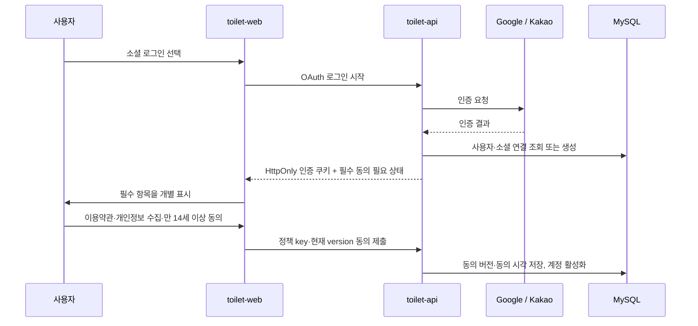

# 개인정보·서비스 약관 및 회원 동의 정책 v1.0

> 기준일: 2026-09-01 · 운영 주체: 급똥(개인 운영 서비스) · 문의: `privacy@geupddong.com`

## 1. 적용 범위와 결정

- 지도와 공중화장실 조회는 연령과 로그인 여부에 관계없이 공개한다.
- 소셜 로그인, 회원가입, 정보 제보와 내 제보 기능은 만 14세 이상만 이용할 수 있다.
- Google/Kakao OAuth는 사용자를 인증하는 수단이며, 급똥의 약관 동의는 OAuth 완료 후 서비스가 직접 받는다.
- 개인정보 처리방침·서비스 이용약관·위치정보 이용 안내는 로그인 없이 항상 열람할 수 있다.
- 기기 GPS는 주변 검색과 직선거리 계산에만 사용하며 일반 지도 조회에서는 서버에 저장하지 않는다.
- 사용자가 위치 제보를 최종 제출한 경우에만 선택 좌표와 도로명 주소를 제보 데이터로 저장한다.

## 2. 가입·동의 흐름

필수 항목을 하나라도 선택하지 않으면 회원 기능은 활성화하지 않는다. 선택 동의는 필수 동의와 시각적으로 분리하며 기본 선택하지 않는다. 필수 정책 버전이 바뀌면 기존 사용자도 최신 버전에 다시 동의해야 한다.

## 3. 정책 문서와 동의 대상

| 정책 key | 화면 문서 | 가입 시 동의 | 목적 |
| --- | --- | :---: | --- |
| `SERVICE_TERMS` | `/policies/terms` | 필수 | 서비스 이용 조건·제보 책임·이용 제한 |
| `PRIVACY_COLLECTION` | `/policies/privacy#collection` | 필수 | 회원·제보 처리에 필요한 개인정보 수집·이용 |
| `AGE_14_PLUS` | `/policies/terms#age` | 필수 | 회원 기능의 만 14세 이상 확인 |
| `PRIVACY_POLICY` | `/policies/privacy` | 열람 | 처리 항목·목적·보유 기간·권리 고지 |
| `LOCATION_NOTICE` | `/policies/location` | 상황별 고지 | GPS 사용 시점·비저장 원칙·권한 철회 방법 |

## 4. 개인정보 항목과 보유 기준

| 정보 | 목적 | 보유 기준 |
| --- | --- | --- |
| 제공자, 제공자 식별값 해시, 표시명, 이메일·인증 여부 | 로그인·계정 식별 | 탈퇴 시까지 |
| 정책 key·version·동의 시각·경로 | 동의 증명·정책 갱신 | 탈퇴 또는 철회 후 3년 |
| 제보 대상·내용·좌표·도로명 주소·처리 결과 | 제보 검토·품질 개선·결과 제공 | 처리 완료 후 3년 |
| access/refresh 세션 | 로그인 유지·세션 폐기 | access 15분, refresh 최대 14일 |
| 감사 로그 | 권한 변경·승인·반려·탈퇴 추적 | 기본 1년, 분쟁 관련 기록은 최대 3년 |
| 일반 접속 로그 | 보안·장애 분석 | 최대 3개월 |

보유 목적이 끝난 정보는 복구하기 어려운 방식으로 파기한다. 법령상 별도 보존 의무가 생기면 해당 항목과 기간을 처리방침에 먼저 반영한다.

## 5. 위치정보 안내 원칙

1. 첫 위치 권한 요청과 현재 위치 버튼 주변에 “주변 화장실·거리 계산에만 사용하고 서버에 저장하지 않음”을 알린다.
2. 권한 거부 후에도 주소·장소 검색과 수동 지도 탐색을 제공한다.
3. `watchPosition` 결과는 브라우저 메모리에서만 사용하고 API 요청 본문이나 운영 로그에 기록하지 않는다.
4. 위치 제보는 별도 화면에서 화장실명, 지도, 도로명 주소를 확인시킨 뒤 제출한다.

## 6. 탈퇴와 파기

- 사용자는 내 계정 화면에서 직접 탈퇴할 수 있다.
- 탈퇴 시 `app_user.status`를 `WITHDRAWN`으로 바꾸고 표시명·이메일을 비식별화한다.
- Google/Kakao 연결 레코드, 역할, 모든 Redis refresh 세션을 즉시 삭제한다.
- 동의 이력은 철회 시각을 남기며, 제보·감사 이력은 정책상 보유 기간 동안 사용자 표시 정보 없이 유지한다.
- 탈퇴 직후 access/refresh 쿠키를 만료하고 재로그인하려면 새 계정 동의 절차를 거친다.

## 7. 외부 서비스와 공개 설정

| 제공자 | 사용 목적 | 공개 설정 |
| --- | --- | --- |
| Google | OAuth 로그인 | OAuth 동의 화면에 홈페이지·개인정보 처리방침·이용약관 URL 등록 |
| Kakao | OAuth 로그인·지도·주소 | 앱 도메인·Redirect URI 등록, Kakao Sync는 비즈 앱·채널 준비 후 별도 검토 |
| Cloudflare | Pages, DNS/보안, Access, Email Routing | `privacy@geupddong.com`을 운영자 메일로 전달 |

## 8. 완료 확인

- [x] 공개 정책 3종 경로와 문의처를 정의했다.
- [x] OAuth 이후 공통 동의 화면과 필수 정책 버전 저장 구조를 정의했다.
- [x] GPS 비저장 원칙과 위치 제보 예외를 분리했다.
- [x] 만 14세 이상 회원 기능 정책을 적용했다.
- [x] 탈퇴 시 소셜 연결·역할·세션 폐기 원칙을 정의했다.
- [x] Cloudflare Email Routing으로 개인정보 문의 주소를 활성화했다.

> 이 문서는 현재 서비스 구현 기준의 운영 초안이다. 서비스 규모, 수익화, 광고·분석 도구, 이메일 발송 또는 사업자 등록 상태가 바뀌면 법률 전문가 검토와 정책 개정을 진행한다.
